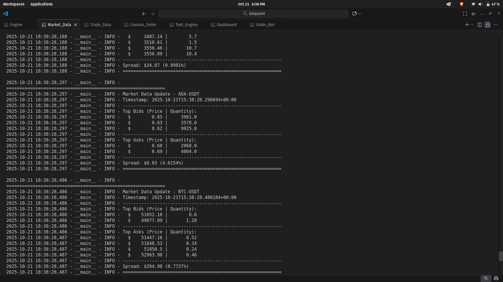
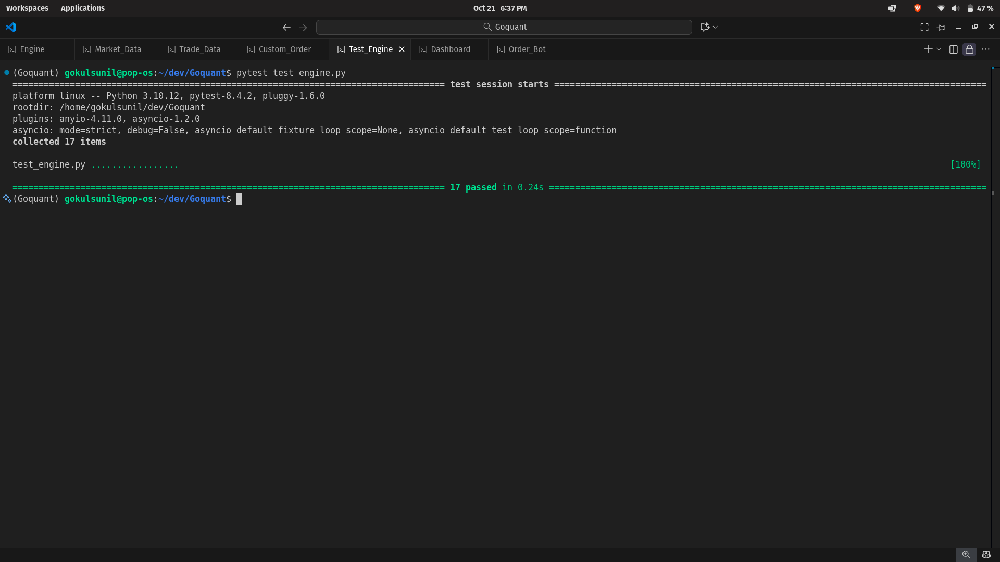

# High-Performance Cryptocurrency Matching Engine Documentation

## Overview

This matching engine is a high-performance, REG NMS-inspired system designed for cryptocurrency trading. It implements price-time priority with internal order protection, ensuring fair and efficient order matching. The engine supports various order types, including market, limit, IOC (Immediate-Or-Cancel), FOK (Fill-Or-Kill), stop-loss, stop-limit, take-profit market, and take-profit limit orders.

Key principles inspired by REG NMS (Regulation National Market System):
- **Price-Time Priority**: Orders are matched based on price first, then time of arrival (FIFO within price levels).
- **Internal Order Protection**: Prevents trade-throughs by matching against the best available prices in the order book.
- **No Multi-Threading Due to Dependencies**: Multi-threading was attempted but not implemented due to compatibility issues with FastAPI libraries in Python 3.13, 3.14 (no-GIL version), and 3.15. Instead, asynchronous programming with `asyncio` is used for handling concurrent operations, such as broadcasting trades and market data.
- **Data Structures for Efficiency**:
  - **Doubly Linked List (DLL) with Hash Map**: Used at each price level for O(1) time complexity in order additions and removals while maintaining time priority.
  - **SortedDict**: From the `sortedcontainers` library, used for bids (descending order) and asks (ascending order) to efficiently manage price levels.

The engine is built using FastAPI for the API layer, with WebSocket support for real-time feeds. It includes persistence via JSON state files, logging, and fee calculations (maker: 0.1%, taker: 0.2%).

### Project Structure

The project consists of the following files:

```
.
├── custom_order.py         # Script for submitting personalized orders to the /order endpoint
├── dashboard.py            # Visual dashboard for viewing trade feeds (requires Tkinter: sudo apt install python3-tk)
├── engine.py               # Core matching engine implementation with FastAPI server
├── market_data_stream.py   # Client script to stream market data from WebSocket endpoint
├── order_bot.py            # Bot script that infinitely submits random orders
├── requirements.txt        # List of Python dependencies
├── test_engine.py          # Pytest-based tests for endpoints and order types
└── trade_data_stream.py    # Client script to stream trade data from WebSocket endpoint
```

## Features

- **Order Types Supported**:
  - Market: Executes immediately at the best available price.
  - Limit: Executes at a specified price or better; rests on the book if not fully filled.
  - IOC: Fills immediately or cancels the remainder.
  - FOK: Fills entirely or cancels if not possible.
  - Stop-Loss: Triggers a market/limit sell (or buy) when price hits or crosses the stop price.
  - Stop-Limit: Triggers a limit order when stop price is hit.
  - Take-Profit Market: Triggers a market order when profit target is reached.
  - Take-Profit Limit: Triggers a limit order when profit target is reached.

- **Order Sides**: Buy and Sell.

- **Order Statuses**: New, Partially Filled, Filled, Cancelled, Rejected.

- **Matching Logic**:
  - Aggressive matching for marketable orders.
  - Conditional orders (stop/take-profit) are held until triggered by last trade price.
  - Fees applied to trades (configurable).

- **Real-Time Feeds**:
  - WebSocket for trades (/ws/trades).
  - WebSocket for market data (order book depth) per symbol (/ws/marketdata/{symbol}).

- **Persistence**: Order books and conditional orders saved to `order_book_state.json` on exit and loaded on startup.

- **Reset Functionality**: Clears all state via /reset endpoint.

- **Performance Metrics**: Logs latencies for order processing, trade generation, and BBO (Best Bid/Offer) updates.

- **Testing**: Comprehensive pytest suite in `test_engine.py` covering all endpoints and order types.

## Architecture and Components

### Key Classes

1. **Order** (Dataclass):
   - Represents a trading order with fields like `order_id`, `symbol`, `order_type`, `side`, `quantity`, `price`, `timestamp`, `status`, etc.
   - Methods: `to_dict()`, `from_dict()`, properties for remaining quantity.

2. **Trade** (Dataclass):
   - Represents an executed trade with fields like `trade_id`, `symbol`, `price`, `quantity`, `timestamp`, `aggressor_side`, etc.
   - Method: `to_dict()`.

3. **Node** (Dataclass):
   - Node for the doubly linked list in `OrderList`.

4. **OrderList**:
   - Doubly linked list for orders at a price level.
   - Supports append (O(1)), remove (O(1) with hash map reference), iteration.

5. **PriceLevel**:
   - Manages orders at a specific price.
   - Uses `OrderList` and a hash map (`order_map`) for O(1) removals.
   - Tracks total quantity at the level.

6. **OrderBook**:
   - Manages bids and asks for a symbol using `SortedDict`.
   - Bids: Sorted descending (highest first).
   - Asks: Sorted ascending (lowest first).
   - Methods: `add_order()`, `remove_order()`, `get_depth()` (top N levels).

7. **MatchingEngine**:
   - Core engine managing multiple order books.
   - Handles order submission, matching, conditional orders, trades.
   - Broadcasts via callbacks (async).
   - Persistence: `save_state()`, `load_state()`.
   - Reset: Clears all data.

### Data Flow

1. Order submitted via API/WebSocket.
2. Validated and processed asynchronously.
3. Matched against order book (aggressive or resting).
4. Trades executed, fees applied, broadcasts sent.
5. Conditional orders triggered on price changes.
6. Market data updated on changes.

## API Endpoints

### POST /order
- **Description**: Submit a new order.
- **Request Body** (JSON):
  ```json
  {
    "symbol": "BTCUSD",
    "order_type": "limit",
    "side": "buy",
    "quantity": 1.5,
    "price": 50000.0,  // Required for limit-based types
    "stop_price": 45000.0  // Required for conditional types
  }
  ```
- **Response**: JSON with status, order_id, filled/remaining quantities, executions.
- **Validation**: Checks for required fields, positive numbers, etc.

### POST /reset
- **Description**: Resets the entire engine (clears order books, trades, conditional orders).
- **Response**: Success or error message.

## WebSocket Endpoints

### /ws/trades
- **Description**: Real-time feed of all trades.
- **Message Format**: JSON trade data (from `Trade.to_dict()`).

### /ws/marketdata/{symbol}
- **Description**: Real-time order book depth for a specific symbol.
- **Initial Message**: Current depth on connect.
- **Updates**: JSON with timestamp, symbol, bids/asks (top 10 levels).

## Installation and Running

1. Install dependencies:
   ```
   pip install -r requirements.txt
   ```
   (Includes `fastapi`, `uvicorn`, `sortedcontainers`, `decimal`, etc.)

2. Run the engine:
   ```
   python engine.py
   ```
   - Server starts at http://127.0.0.1:8000.

3. For dashboard (optional):
   ```
   sudo apt install python3-tk
   python dashboard.py
   ```

4. Testing:
   ```
   pytest test_engine.py
   ```

## Additional Files and Usage

### custom_order.py
- **Description**: Script for submitting personalized orders to the /order endpoint. Allows custom JSON payloads for testing specific scenarios.

**Screenshot Placeholder**:


### dashboard.py
- **Description**: Visual dashboard using Tkinter to display real-time trade feeds. Connects to /ws/trades and shows trades in a GUI.

**Screenshot Placeholder**:


### engine.py
- **Description**: Core file containing the matching engine, classes, and FastAPI server. This is the main executable.

**Screenshot Placeholder**:


### market_data_stream.py
- **Description**: Client script to connect to /ws/marketdata/{symbol} and print real-time market data updates.

**Screenshot Placeholder**:


### order_bot.py
- **Description**: Bot that infinitely submits random orders to the /order endpoint for load testing or simulation.

**Screenshot Placeholder**:


### requirements.txt
- **Description**: List of Python packages required (e.g., fastapi, uvicorn, sortedcontainers, etc.).

**Screenshot Placeholder**:


### test_engine.py
- **Description**: Pytest suite testing all endpoints (/order, /reset) and order types. Run with `pytest test_engine.py`.

**Screenshot Placeholder**:


### trade_data_stream.py
- **Description**: Client script to connect to /ws/trades and print real-time trade executions.

**Screenshot Placeholder**:


## Limitations and Future Improvements

- **No Multi-Threading**: Relies on async for concurrency; could explore alternative libraries for true parallelism.
- **Security**: No authentication; add JWT or API keys for production.
- **Scalability**: Single-instance; consider clustering for high volume.
- **Error Handling**: Basic; enhance with more granular exceptions.
- **Monitoring**: Integrate Prometheus/Grafana for metrics.

## License
This project is open-source under the MIT License (assumed; adjust as needed).